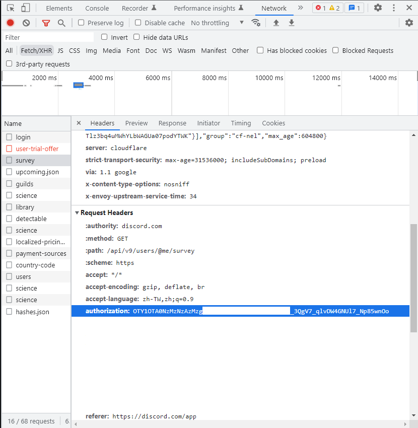

# Lycoris Discord Custom Status
專門給lycoris中毒的使用者更新自己的discord自訂狀態

## Demo

## How To Use
1. 安裝Node.js
2. 執行 `npm install`
3. 開啟無痕瀏覽器
4. 開啟F12後前往[https://discord.com/login](https://discord.com/login)登入Discord帳號
5. 切換到Network篩選Fetch/XHR
6. 隨便查看一個請求的詳細資訊
7. 複製authorization這個header的內容(如下圖)到.env中
8. 執行`node index.js`

